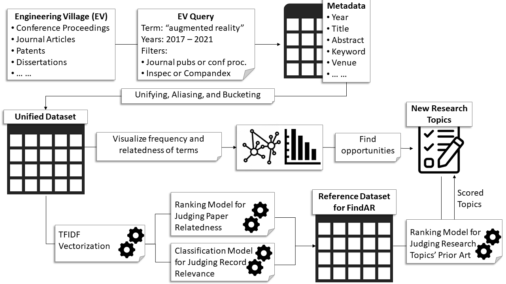

[[ra-first-method-section]]

=== Meta-Analysis of Related Work
Since there is insufficient guidance in the research community and from other public resources for how to define and prioritize future research topics, the AREA Research Committee developed its own methodology as part of the 8th AREA Research Project. The Research Committee will adapt the process and update this section in subsequent editions.

////Footnote testfootnote:[The double hail-and-rainbow level makes my toes tingle.]

////Author-year references can use different styles such as: cite:[Feynman1963118] or
////citenp:[palmarini2018systematic].

.Overall methodology of deriving decisions from a broad publication dataset
[#img-methodology]
[caption="Figure 1: "]

*Prior Published Works Relevant to Enterprise AR*

To build a valuable enterprise AR research agenda, the relevant on-going and past research on the topic needs to serve as the foundation. This includes both academic and industrial research. A key challenge facing this process is the lack of visibility into the landscape of industrial research activities. In other words, trends in research and development across industry are difficult to asses with minimal bias since a company's publishing on their latest developments directly conflicts with their competitive advantage. On the other hand, academic efforts are much easier to track and to analyze since AR research results are reported through academic venues, such as journals and conference proceedings. In order to reduce bias and to rigorously follow a repeatable process, this research agenda only considers academic work for baselining the current enterprise AR research landscape.

*Developing a System Boundary*

As shown in <>, this research agenda leverages a well-known technical document search tool, called Engineering Village. Engineering Village covers https://www.elsevier.com/solutions/engineering-village/features["high-quality, relevant and cross-disciplinary content, enabling engineers and researchers to perform thorough and effective literature reviews, analyze the research landscape, and solve problems"]. The search for past academic research findings includes peer-reviewed journal publications and conference proceedings but excludes standards, patents, books, and engineering dissertations. The database of work used for gap identification spans the period beginning in January 2017 and include any works available up to June 2021. If "augmented reality" appears in any metadata field, e.g., abstract, keywords, and title, the records of the item's metadata, including but not limited to a DOI, abstract, set of keywords, publication year, and venue, related to each returned publication are stored.

*Aligning Publication Indexing Services*

Engineering Village leverages existing publication indexing services, most notably Inspec and Compandex. In the field of Augmented Reality, Inspec and Compandex are by the far the biggest contributors to the publication database. To align these two databases, the AREA research agenda uses a data-driven methodology.

Engineering Village offers three columns of keyword types, including "controlled/subject terms," "uncontrolled terms," and "classification code." The analysis performed for the AREA Research Agenda leverages "controlled/subject terms" as the ground truth keywords for the rest of the analysis, since the terms adhere to a term taxonomy defined by the two indexing services (unlike "uncontrolled terms") yet exhibit low-level specificity to delineated critical topics (unlike "classification code").

As shown in <>, the team that developed this research agenda manually created aliasing rules to (1) align terms from one indexing service to another with the same meaning, (2) remove British spelling and adhere to US English conventions, and (3) unify plural versions of terms with their singular versions. Interested readers can review the aliasing rules in https://github.com/theareaorg/AREA-Research-Agenda/blob/main/FindAR/Data/replacements-new.csv[this CSV file].

*Term Bucketing: Building a Hierarchy of Terms for Data Analysis*

The final stage of <> is the bucketing of terms within "groups" and "categories." Further discussion is available about https://github.com/theareaorg/AREA-Research-Agenda/blob/main/Documentation/About-Low-Level-Terms.adoc[machine-generated terms], and the research agenda's https://github.com/theareaorg/AREA-Research-Agenda/blob/main/Documentation/About-Mid-And-High-Level-Terms.adoc[groups and categories].

The AREA team collaboratively assigned each machine-generated term to one group. Groups were then assigned to seven categories:

- Displays,
- End Users and User Experience,
- Industries,
- Standards,
- Technologies, and
- Use Cases

All publication records that do not have any machine-assigned terms after employing deletion rules are placed in the "other" group and category. Note that one-to-one mappings between terms and groups as well as groups to categories are required in this particular task, however, in practice, most terms could be assigned to multiple groups and most groups could belong in multiple categories.

*Frequency and Co-occurrence Charts based on Term Hierarchy*

Indicated by <>, after the machine-assigned terms are bucketed within group and categories, frequencies are calculated for all terms across individual records. Co-occurrences of terms across records are also calculated. Based on the frequencies and co-occurrences, a set of visualizations provide the research agenda team members insight into the data. For those who seek to better understand absolute frequencies of terms, the sorted barcharts which form the basis for identification of research gaps https://github.com/theareaorg/AREA-Research-Agenda/tree/main/FindAR/Visualizations/Category%20Viz[are available].

*Network-based Understanding of Terms*

Based on the co-occurrence values for each two-term pairing, a graph captures term-to-term relationships.  In this graph, each node represents a term and each edge represents a co-occurrence. Leveraging spatial layout algorithms, we can then understand closeness of term clusters based on node and cluster proximity. We used https://gephi.org/[Gephi], an open graphic visualization platform, to manipulate the graphs, create sub-graphs, and encode different visual variables, including hue and color, on the nodes and edges to enhance sense-making. In doing so, we created graphs that serve as an alternative view of the dataset compared with the barcharts.

*Identifying Opportunities for New Research*

Based on poorly represented terms and clusters in the barcharts and graph visualizations, the team then identified research gaps and opportunities. This portion of the methodology was done subjectively, relying on the team's expertise in understanding the current state of enterprise AR and the research landscape.

*Vectorizing Records Language through Natural Language Processing*

Natural language, including publication titles, abstracts, and author-assigned keywords, represents most of the data in the dataset. To draw insights across publication records, we deploy common natural language processing (NLP) techniques. The foundation for these techniques is term frequency-inverse document frequency (TF-IDF). TF-IDF is a statistical measure that evaluates the importance of a word with respect to a record within a collection of records. TF-IDF takes into account the prevalence of a particular word within a record of interest and also the importance of that same word across the entirety of all the records.

.Schematic and example of how TF-IDF transforms natural language into numerical vectors
[#img-tfidf]
[caption="Figure 2: "]
image::figures/tfidf-general.png[tfidf,800,400]

<> shows a simplified view of TF-IDF vectorization, where the collection of records is represented by a large unified vector of all possible words. Representing records as numerical values, instead of strings, also increases efficiencies of subsequent data processing.

Before using TF-IDF vectorization to the publication dataset, we removed all "stopwords" from each record's abstract.  We leverage the existing stopwords corpus form the https://www.nltk.org/book/ch02.html[NLTK Python library]. We then "hyphenate" each individual keyword in all records and concatenate each record's hyphenated keywords to the truncated abstract. In doing so, all subsequent data processing stages treat each multi-word keyword as a single word.  <> shows an example of the result of concatenating a record's cleaned abstract with its hyphenated keywords.

.Example of a record's cleaned abstract concatenated with its hyphenated keywords
[#img-tagAbstract]
[caption="Figure 3: "]
image::figures/tagAbstract.png[tfidf,750,400]

*Judging Relevance of Each Publication Record to AREA Members*

With each record's abstract and keywords vectorized through TF-IDF, we can then leverage machine learning based techniques to deepen understanding of the dataset.

To support the usability of FindAR, we first aimed to semi-automatically classify which publications would be of most interest to AREA membership. To do so, we employed an active learning approach, wherein a set of experts labeled about 20% of all publication records as either relevant or not. Then a https://scikit-learn.org/stable/modules/generated/sklearn.linear_model.SGDClassifier.html[Stochastic Gradient Descent Classifier] was used to predict the relevance of the remaining unlabeled data. Paper relevance was based on the TF-IDF vectorization of the cleaned abstract alone over 1000 iterations then leveraged the keywords to predict the rest.

*Judging Relatedness of Every Record in the Publication Databases*

With the TF-IDF vectorization of the concatenation of the clean abstract and hyphenated keywords, we measured the cosine similarity of each record's corpus against all other records. In doing so, we identified the top-20 most related (or similar) records for the FindAR tool.

*Ranking Research Opportunities based on Amount of Relevant Prior Art*

After the research topics were written up, we used the same cosine similarity-based technique to quantify the similarity of the research topic descriptions against all records in the publication dataset. More information about the scoring method is found here[https://github.com/theareaorg/AREA-Research-Agenda/blob/main/AREA_Research_Agenda_2021/rt_score_explanation.adoc]

*Bibliography*

bibliography::[]
