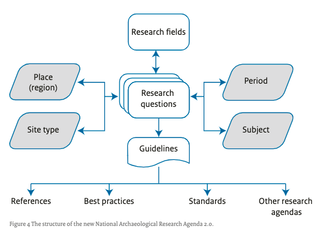

[[ra-methodology-section]]
== Methodology

////NOTE: Introduction to the section saying that there are many ways to develop research agendas.

There is not a single widely-accepted or standard method or protocol for developing a research agenda. Each institution can develop its own methods or adapt methods used by others. Some may find it valuable to learn about the principles of research agenda development by perusing https://www.google.com/search?q=research+agenda+purpose+and+structure&tbm=isch&source=univ&sa=X&ved=2ahUKEwip1P2GlZrgAhUFGewKHTNZBTQQsAR6BAgGEAE&biw=1918&bih=961#imgrc=gt2OdYGnFtia1M[figures describing different approaches others have used.]

One particularly useful figure is from the https://www.researchgate.net/profile/Bert-J-Groenewoudt/publication/321882122_Groenewoudt_BJ_MC_Eerden_T_de_Groot_EM_Theunissen_2017_Answers_to_questions_The_new_National_Archaeological_Research_Agenda_of_the_Netherlands/links/5a37c068a6fdccdd41fdb740/Groenewoudt-BJ-MC-Eerden-T-de-Groot-EM-Theunissen-2017-Answers-to-questions-The-new-National-Archaeological-Research-Agenda-of-the-Netherlands.pdf[Dutch Archeological Research Agenda] published in 2017. Figure 4 in this report, appears below.

.Dutch Archeological Research Agenda
[#img-dutch]
[caption="Figure 1: "]

The figure shows how a research agenda takes into context factors such as region, time frame, subjects and can lead to guidelines for the production of best practices, standards and other research programs needed by stakeholders.

Another source of information about research agenda development is the site of the Responsible Research and Innovation (RRI) project. In Horizon 2020, the EU Programme for Research and Innovation 2014-2020, Responsible Research and Innovation is a cross-cutting theme. Horizon 2020 projects were incentivized to involve society in science and innovation as early in the processes of R&I as possible in order to align strategic planning outcomes with the values of society.

The https://rri-tools.eu/[RRI Toolkit] provides resources for policy makers, members of the research and educational communities, stakeholders in industry and non-profit, civil society organizations. Similarly, the AREA Research Agenda may expand to serve its different target audiences by providing resources to support research on AR topics.

=== Participatory Research
AREA members may find it difficult to separate the development of the research agenda itself and the involvement of AREA members in the research projects proper. http://www.participatorymethods.org/task/research-and-analyse[This page] defines “Participatory Research” as both a range of methods and an ideological perspective. Its fundamental principles are that the subjects of the research become involved as partners in the process of the enquiry and that their knowledge and capabilities are respected and valued. Participatory research is ultimately about relationships and power. The key relationships are between the researcher and the researched and between local people and those actors they see as powerful and who affect their lives. Participatory researchers act as facilitators and work towards attaining equality in these two relationships. We are not excluding participatory research as a recommendation for researchers in enterprise AR however it needs to be clearly separate from a collaboratively-defined research agenda which could be used by anyone in the enterprise AR field.

We are not excluding participatory research as a recommendation for researchers in enterprise AR, however, it needs to be clearly separate from a collaboratively-defined research agenda which can be used by anyone in the enterprise AR field.

=== Core Principles
It is the goal of the AREA Research Committee to emphasize values of openness, collaboration and participation in the development process. The AREA methodology is also recursive (views itself as part of the methodology).
